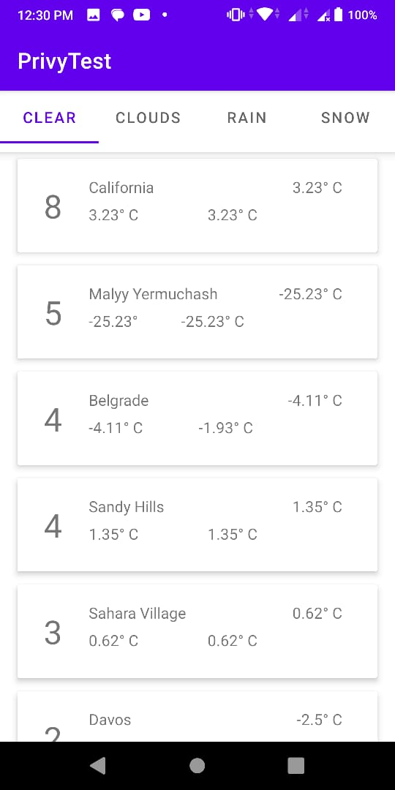

#WeatherApp

## PriviyTest Android

### Technology
- MVVM
- Coroutines
- Retrofit
- Dagger Hilt
- Glide
- Data Binding

### Flow

By hitting 10 times the getForecast api, collect and filtered all datas to map

### Screenshot

